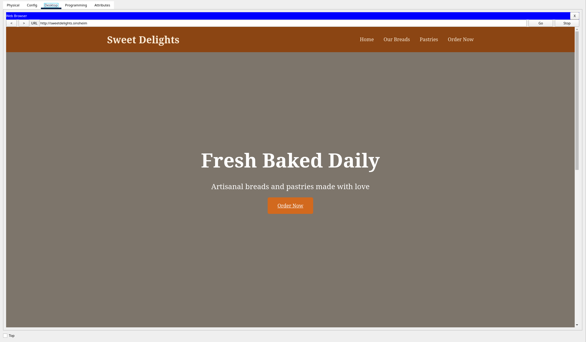

# Webdesign & Marketing Soliman

## Über "Webdesign & Marketing Soliman GmbH"

### Unternehmensgegenstand

Die Webdesign & Marketing Soliman GmbH ist ein innovatives Dienstleistungsunternehmen, das sich auf die Entwicklung und Umsetzung digitaler Medienlösungen spezialisiert hat. Als GmbH strukturiert, konzentriert sich das Unternehmen auf zwei strategisch wichtige Hauptgeschäftsfelder. Im Bereich Webdesign und Webentwicklung bietet das Unternehmen die Entwicklung von High-Performance Websites mit excellentem SEO-Score, Responsive Design für optimale Darstellung auf allen Endgeräten, moderne UI/UX-Konzepte für maximale Benutzerfreundlichkeit, Content Management Systeme (CMS) für einfache Pflege sowie regelmäßige Performance-Optimierung und Wartung an.

Im zweiten Hauptgeschäftsfeld, dem digitalen Marketing, liegt der Fokus auf Suchmaschinenoptimierung (SEO) für Top-Rankings, Social Media Marketing und Community Management, Content Marketing und Storytelling, E-Mail Marketing Kampagnen sowie Analytics und Conversion-Optimierung.

### Unternehmensaufbau

Die Firma zeichnet sich durch eine effiziente, dreigliedrige Organisationsstruktur aus:

Die Geschäftsführung ist mit modernster mobiler Technologie wie High-End Laptops und aktuellen Smartphones ausgestattet, um optimale Erreichbarkeit und Flexibilität zu gewährleisten. Die professionelle Webdesign-Abteilung besteht aus hochqualifizierten Webdesignern, die an ergonomisch gestalteten Arbeitsplätzen arbeiten. Diese ist eng mit einem erfahrenen Marketing-Team verbunden, wodurch eine ganzheitliche Projektbearbeitung ermöglicht wird.

### Unternehmensgröße

Als dynamisches mittelständisches Unternehmen verfügt die Firma über ein effizientes Team von 5-10 hochspezialisierten Mitarbeitern, die in einer modernen Bürostruktur eng zusammenarbeiten. Das innovative Kombibüro-Konzept mit verschiedenen Fachabteilungen fördert dabei die Kommunikation und Kreativität zwischen den Mitarbeitern. Ein Beispiel Kundenauftrag für die Bäckerei "Sweet Delights", eine Bäckerei mit amerikanischen Backwaren:

---

## Über das Netzwerk

Die Netzwerkinfrastruktur des Unternehmens basiert auf mehreren Kernkomponenten. Im Zentrum steht ein DNS & DHCP Server, der die grundlegenden Netzwerkdienste bereitstellt. Die räumliche Gestaltung als Kombibüro ermöglicht eine enge Zusammenarbeit zwischen den Webdesign- und Marketing-Teams. Für maximale Flexibilität wurde eine mobile Geräteanbindung implementiert, die es den Mitarbeitern ermöglicht, von verschiedenen Standorten aus zu arbeiten. Zusätzlich verfügt das Unternehmen über eine professionelle Webserver-Struktur zur Verwaltung und Bereitstellung der Kundenaufträge.

### Namenskonzept

In der "Webdesign & Marketing Soliman GmbH" entsprechen die Namen der Geräte im Netz ihrer physischen Lage im Bürogebäude bspw. `OFFICE_1F` oder bei Endgeräten → Art des Endgerätes + Bereich wie bspw. `PC_EMPFANG`. Dies ermöglicht bei einer Vielzahl von Geräten eine schnelle Lokalisierung jedes einzelnen Geräts.

### Zugangsdaten

| Bezeichnung        | WIFI_SSID | Privileged EXEC    | Konsolenport | Domaine       | User  | Passwort | WLAN PW    |
| ------------------ | --------- | ------------------ | ------------ | ------------- | ----- | -------- | ---------- |
| CENTRAL_MULTILAYER | -         | CENTRAL_MULTILAYER | multilayer   | multilayer.de | admin | web      | -          |
| OFFICE_1F          | -         | OFFICE_1F          | 1floor       | 1floor.de     | admin | web      | -          |
| OFFICE_2F          | -         | OFFICE_2F          | 2floor       | 2floor.de     | admin | web      | -          |
| CENTRAL_R1         | -         | central            | centralr1    | centralr1.de  | admin | web      | -          |
| WIFI_1F            | WIFI_1F   | -                  | -            | -             | -     | -        | WIFI1FLOOR |
| WIFI_2F            | WIFI_2F   | -                  | -            | -             | -     | -        | WIFI2FLOOR |
| RECEPTION_SW       | -         | RECEPTION_SW       | reception    | reception.de  | admin | web      |            |

### Netztopologie

## Adressierungstabelle

| Gerätename              | Interface | IPv4/6-Adresse/DHCP | Subnetzmaske    | Default Gateway |
| ----------------------- | --------- | ------------------- | --------------- | --------------- |
| CENTRAL_R1              | VLAN60    | 10.195.0.188        | 255.255.255.224 | 10.195.0.189    |
| SERVER_CENTRAL          | VLAN50    | 10.195.0.129        | 255.255.255.224 | 10.195.0.158    |
| RECEPTION_SW            | VLAN10    | 10.195.0.27         | 255.255.255.224 | 10.195.0.30     |
| OFFICE_1F               | VLAN10    | 10.195.0.28         | 255.255.255.224 | 10.195.0.30     |
| OFFICE_2F               | VLAN10    | 10.195.0.29         | 255.255.255.224 | 10.195.0.30     |
| LAPTOP_CEO              | VLAN30    | DHCP                | 255.255.255.224 | 10.195.0.94     |
| IPhone_CEO              | VLAN30    | DHCP                | 255.255.255.224 | 10.195.0.94     |
| PC_EMPFANG              | VLAN20    | DHCP                | 255.255.255.224 | 10.195.0.62     |
| PC_WEBDESIGNER          | VLAN40    | DHCP                | 255.255.255.224 | 10.195.0.62     |
| IPhone_webdesigner      | VLAN40    | DHCP                | 255.255.255.224 | 10.195.0.62     |
| CENTRAL_R1              | G0/1      | 10.0.0.1            | 255.255.255.0   | -               |
| dns.sinsheim            | F0        | 10.0.0.2            | 255.255.255.0   | -               |
| sweetdelights.webserver | F0        | 10.0.0.3            | 255.255.255.0   | -               |

### VLANs

| VLAN-Nummer | VLAN-Name          | Default Gateway |
|:-----------:| ------------------ | --------------- |
| 10          | MANAGEMENT         | 10.195.0.30/27  |
| 20          | EMPFANG            | 10.195.0.62/27  |
| 30          | CHEFETAGE          | 10.195.0.94/27  |
| 40          | ENTWICKLUNG_DESIGN | 10.195.0.62/27  |
| 50          | SERVER             | 10.195.0.158/27 |
| 60          | WAN                | 10.195.0.189/27 |

Herangehensweise Subnetting für VLAN:

- 30 Hosts für jedes VLAN (mehr als genug für die derzeitige 3 hosts benötigt bei der aufgabenstellung)

### IP Adressen Pool der VLANs

| VLAN    | Netzwerk     | Subnetmaske | Broadcastadresse | Hostrange                   |
| ------- | ------------ | ----------- | ---------------- | --------------------------- |
| VLAN 10 | 10.195.0.0   | /27         | 10.195.0.31      | 10.195.0.1 - 10.195.0.30    |
| VLAN 20 | 10.195.0.32  | /27         | 10.195.0.63      | 10.195.0.33 - 10.195.0.62   |
| VLAN 30 | 10.195.0.64  | /27         | 10.195.0.95      | 10.195.0.65 - 10.195.0.94   |
| VLAN 40 | 10.195.0.96  | /27         | 10.195.0.127     | 10.195.0.97 - 10.195.0.126  |
| VLAN 50 | 10.195.0.128 | /27         | 10.195.0.159     | 10.195.0.129 - 10.195.0.158 |
| VLAN 60 | 10.195.0.159 | /27         | 10.195.0.190     | 10.195.0.160 - 10.195.0.189 |
